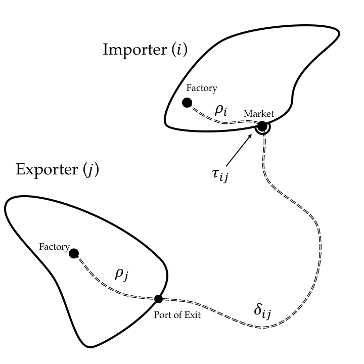

# Prices and Trade Costs {id="tcostMap"}

$$
p_{ji}(\omega) = d_{ji} p_{ii}(\omega)
$$

$$
d_{ij} = \rho_j \delta_{ij} \tau_{ij}
$$

- $\tau_{ij} = 1 \implies$ no policy distortion
- $\tau_{jj} = \delta_{jj} = 1$

$$
p_i^\star(\omega) = \min_{j \in \left\{ 1,...,N \right\}} \left\{ p_{ij} \right\}
$$

$$
\Omega_{ij}^\star = \left\{ \omega \in [0,1] \text{ } \bigg| \text{ } p_{ij}(\omega) \leq \min_{k \neq j} \left\{ p_{ik} \right\} \right\}
$$

## Equilibrium

**Prices**

$$
P_i(\bm{w}) = \left( \int_{\omega \in [0,1]} \alpha_{h(\omega)} p_i^\star(\omega)^{1 - \sigma} d \omega \right)^{\frac{1}{1 - \sigma}}
$$

. . .

**Trade Flows**

$$
X_{ij}(\bm{w}) = \int_{\color{bcOrange} \omega \in \Omega_{ij}^\star \color{black}} p_{ij}(\omega) \tilde{q}_i \left( p_{ij} (\omega) \right) d \omega
$$

- $\tilde{q}_i \left( p_{ij} (\omega) \right)$ - consumer and producer demand for good $\omega$

. . .

**Market Clearing**

\begin{equation}
\underbrace{\sum_{j} X_{ji}(\bm{w})}_{\text{tradable sales}} + D_i = \underbrace{\sum_j X_{ij}(\bm{w})}_{\text{tradable expenditure}}
\label{eq:marketClearing}
\end{equation}

. . .

**Definition:** An *international equilibrium* is a vector of wages $\bm{w}$ such that ($\ref{eq:marketClearing}$) holds for each country.

- @Alvarez2007: existence and uniqueness

# Identification (I) {id="identification"}

- $\lambda_{ij} = \frac{X_{ij}}{E_i}$ - share of $i$'s tradable expenditure spent on goods from $j$

**Gravity Equation**

$$
\lambda_{ij} = \frac{ T_j \left( \color{bcOrange} d_{ij} \color{black} w_j^{1 - \beta} P_j^{\beta} \right)^{- \theta} }{\gamma^{-1} P_i^{-\theta}}
$$

- $\color{bcOrange} d_{ij} \color{black} = \rho_j \delta_{ij} \tau_{ij}$

**Origin Differences**

$$
\frac{\lambda_{ij}}{\lambda_{jj}} = \left( \delta_{ij} \tau_{ij} \frac{P_j}{P_i} \right)^{-\theta}
$$

## Identification (II) 

**Origin Differences**

$$
\frac{\lambda_{ij}}{\lambda_{jj}} = \left( \delta_{ij} \tau_{ij} \frac{P_j}{P_i} \right)^{-\theta}
$$

. . . 

**Rationales for Divergence ($\frac{\lambda_{ij}}{\lambda_{jj}} < 1$)**

## Identification (II) 

**Origin Differences**

$$
\frac{\lambda_{ij}}{\lambda_{jj}} = \left( \delta_{ij} \tau_{ij} \color{bcOrange} \frac{P_j}{P_i} \color{black} \right)^{-\theta}
$$

**Rationales for Divergence ($\frac{\lambda_{ij}}{\lambda_{jj}} < 1$)**

1. Price differences, $\color{bcOrange} P_j < P_i$

## Identification (II) 

**Origin Differences**

$$
\frac{\lambda_{ij}}{\lambda_{jj}} = \left( \color{bcOrange} \delta_{ij} \tau_{ij} \color{black} \frac{P_j}{P_i} \right)^{-\theta}
$$

**Rationales for Divergence ($\frac{\lambda_{ij}}{\lambda_{jj}} < 1$)**

1. Price differences, $P_j < P_i$
2. Trade costs $\color{bcOrange} \delta_{ij} \tau_{ij} > 1$

. . . 

**Inversion**

$$
\tau_{ij} = \left( \frac{\lambda_{ij}}{\lambda_{jj}} \right)^{-\frac{1}{\theta}} \frac{P_i}{P_j} \frac{1}{\delta_{ij}}
$$