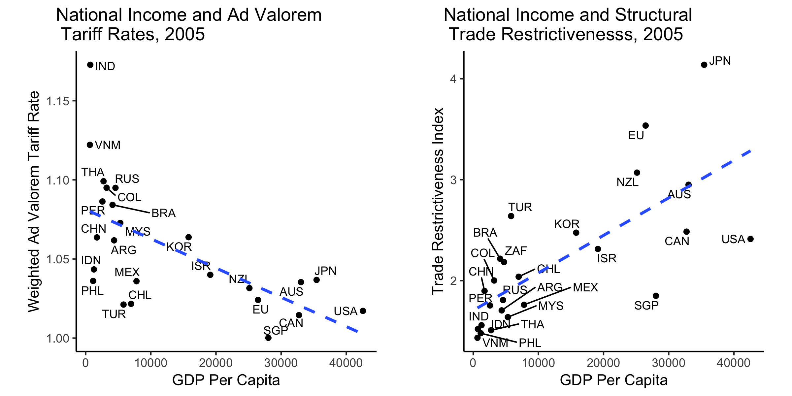
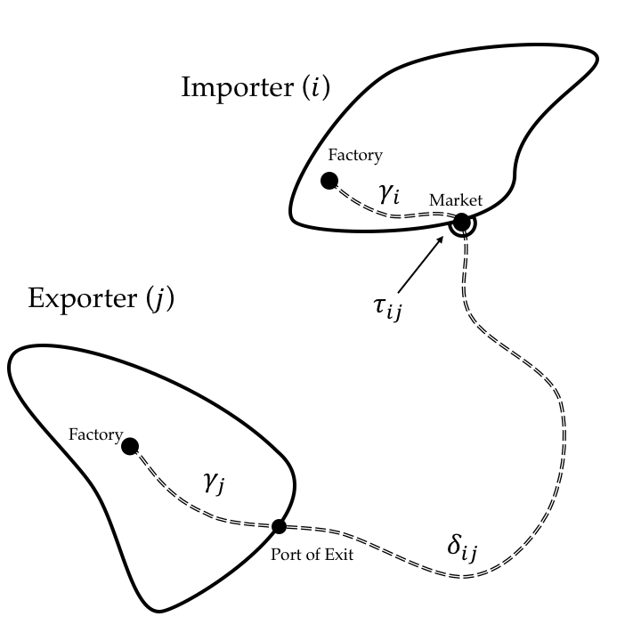
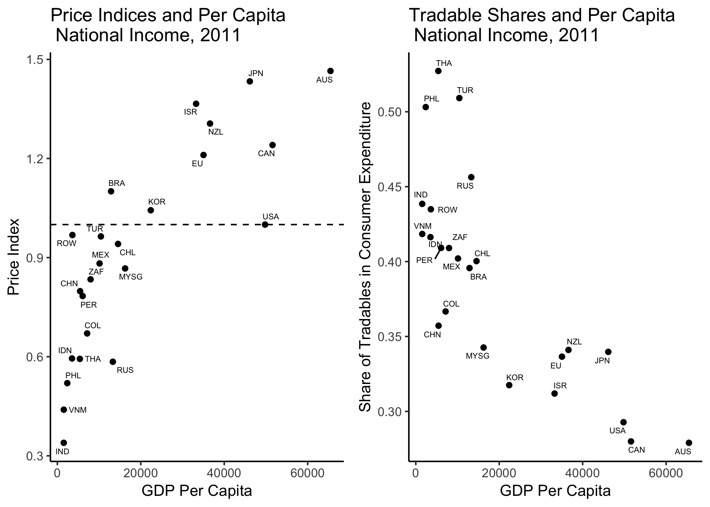
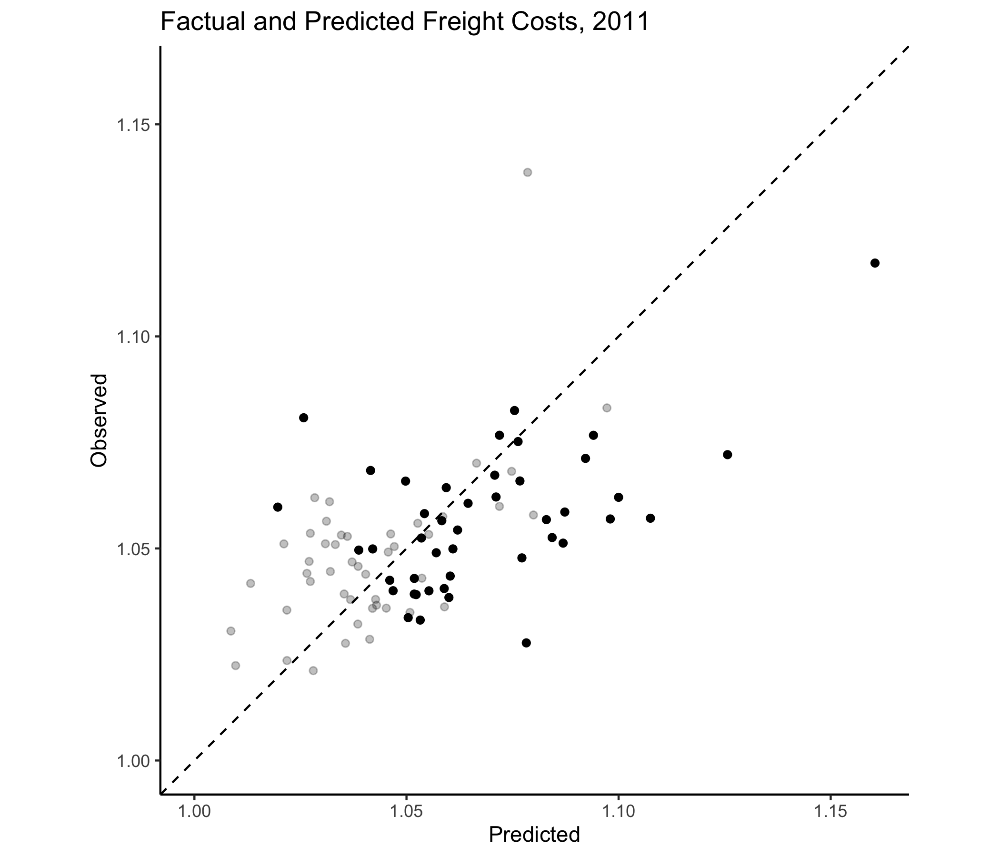
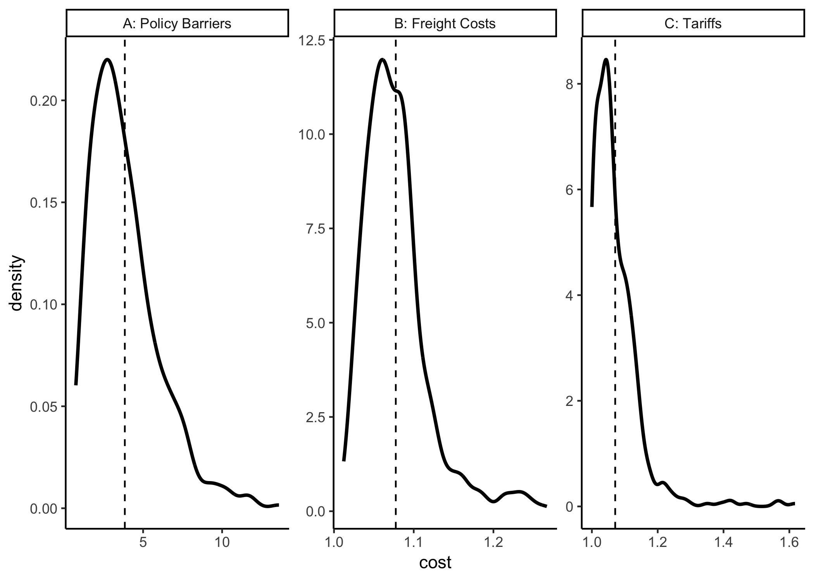
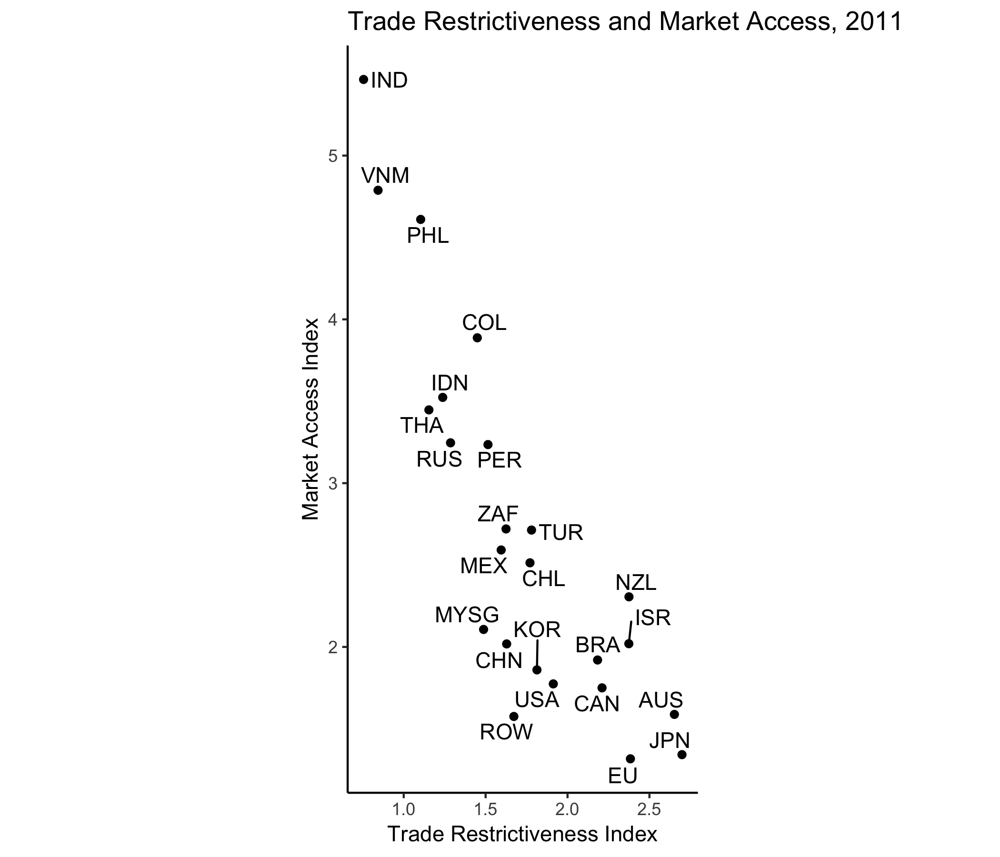
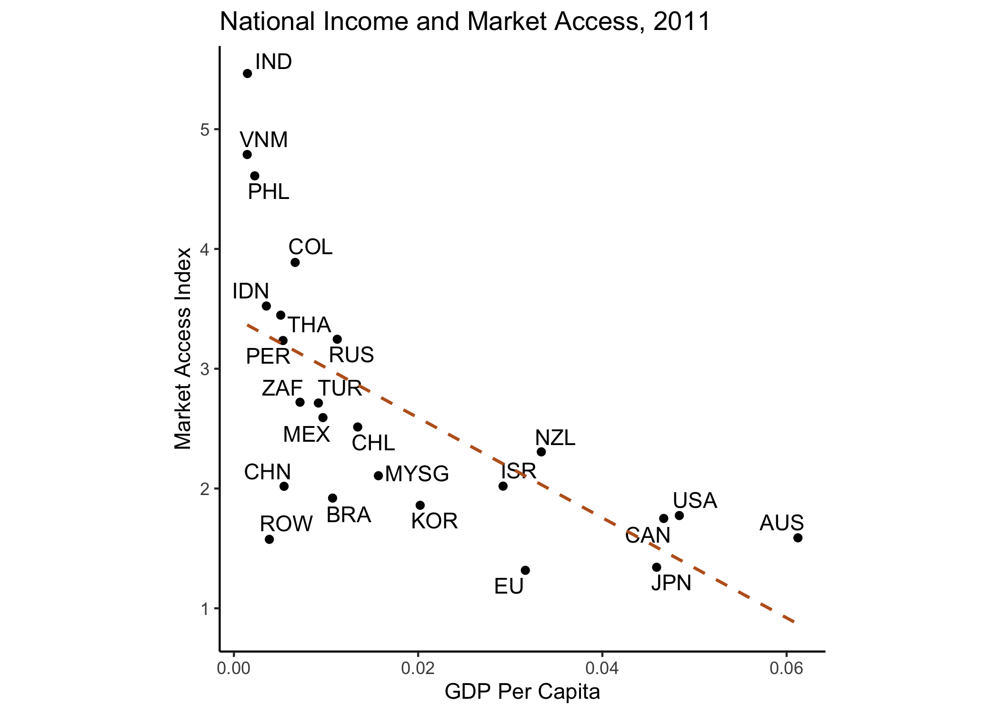

\newpage

# Introduction


Is international trade free and fair? For trade to be free, firms must not face government-imposed burdens to foreign market access. I refer to these burdens as policy barriers to trade. For trade to be fair, any policy barriers that do exist must treat products from all origin countries equally.^[Of course, there are many competing conceptions of what a free and fair international trading system should look like. These are the definitions of free and fair I use here.]

Examining tariff rates produces a qualified "yes," on both counts. Despite recent threats to the world trading system,^[See Bown, Chad P. ["Is the Global Trade System Broken?"](https://piie.com/commentary/op-eds/global-trade-system-broken) *Peterson Institute for International Economics*. 8 May 2018.] tariffs remain at historically low rates (less than five percent on most trade [@Baldwin2016]), suggesting trade is relatively free. Moreover, World Trade Organization (WTO) member countries, accounting for the vast majority of the world economy, commit to the principle of nondiscrimination (or most-favored-nation (MFN)) in tariff policy, applying the same tariff rates to the imports of all member countries. At first glance, adherence to this principle suggests international trade is also fair. 

However, tariffs are but one instrument by which governments can influence the flow of trade. *Direct* barriers to trade are imposed at national borders or ports of entry. In addition to tariffs, governments also impose many non-tariff regulations on imports. Often referred to collectively as nontariff measures (NTMs), these regulations require that prospective importers comply with these price controls, quotas, quality and safety requirements, and other rules in order to access foreign markets.^[For studies of these kinds of barriers, see @Mansfield1995b; @Lee1997; @Gawande1999; @Kono2006; @Rickard2012; @Maggi2018.]

*Indirect*, or "behind-the-border", barriers are economic policies not assessed at the border that nevertheless disproportionately affect imported goods. Government procurement rules often explicitly privilege domestic suppliers, resulting in increased domestic purchases and reduced imports [@Evenett2004; @Kono2014]. Excise taxes, while implemented uniformly on a single good, may primarily fall on imports if targeted at goods with high foreign content.^[Sin taxes on alcohol and cigarettes might distort trade if these products are generally imported.] Subsidies and tax credits made available to domestic firms allow less productive firms to survive, supplanting importers in home markets and reducing trade. The burden of complying with health, safety, and environmental regulations may also fall disproportionately on foreign firms, reducing their sales and distorting trade.

All of these instruments can in principle be targeted to generate *de facto* discrimation. For example, the MFN principle is enforced at the tariff line level, allowing importers to target duties at products exported by specific countries, without running afoul of WTO rules. Through high agricultural duties, the United States, Europe, and Japan effectively discriminate against the developing world, which specializes in the production of these products [@Anderson2005]. NTMs and behind-the-border barriers can produce effective discrimination in the same manner.

Even armed with data on all such trade-distorting policy instruments, estimating the magnitude of aggregate policy barriers to trade would be challenging. Here, I propose and implement a new method to estimate policy barriers to trade with minimal data requirements. I construct a parsimonious model of international trade subject to frictions, following @Eaton2002.^[Theirs is a Ricardian model, in which the basis for trade emerges from differences in technologies across countries.] I show that the magnitude of trade frictions between two countries $i$ and $j$ is related by the theoretical model to price levels in both countries, trade flows between them, and the market shares of domestic producers in home markets. I then decompose these barriers into their economic (transportation costs) and political (policy barriers) components. Finally, I calibrate this relationship to the data on prices, trade, and freight costs in 2011.

The intuition underlying the model is straightforward. Cross-national price gaps inform about the existence of arbitrage opportunities, and imply that large trade flows should exist from countries with low prices toward those with high prices. The extent to which these flows are realized in the data informs about the magnitude of trade costs. If the cost of freight between countries is known, than the component of these costs than cannot be attributed to purely economic frictions can be independently identified. The remaining "missing trade" is attributed to the existence of policy distortions, broadly defined.

The logic behind the approach employed here is also articulated in @Leamer1988. If consumers are homogenous across countries, they will consume the same basket of goods when trade is frictionless (and prices equalize across markets).^[Empirical studies of trade rely heavily on the (dubious) assumption of consumer homogeneity. For a prominent counterexample, see @Fajgelbaum2016. I hold consumers' preferences over tradable goods constant, but allow for heterogeneity in consumers' taste for tradable versus nontradable goods.] Observered heterogeneity in consumption baskets is then informative about the magnitude of trade frictions. Leveraging advances in the structural gravity literature, I am able to empirically connect Leamer's basic insight more tightly to theory.

The results point to far more policy distortion and effective discrimination than would be inferred from the tariff data. Tariff equivalents of implied policy barriers are generically more than an order of magnitude larger than observed tariffs. Moreover, exporters in subset of favored countries enjoy far superior market access counditions than their peers in unfavored countries.



The trade policy openness attributed to developed countries also depends strongly on the metric used to evaluate openness.^[See @Rodriguez2000, @Dollar2004, and @Tavares2008 for discussions of this phenomenon.] As shown in Figure \ref{fig:triIncome}, there is a negative association between economic development (per capita GDP) and applied tariff rates. This relationship is reversed if trade policy restrictiveness is measured as proposed here. Countries with higher per capita incomes tend to have higher Trade Restrictiveness Indices.^[See Equation \ref{eq:tri}.] This is consistent with @Kono2006 and @Queralt2015, which suggest that developed countries offset tariff reductions with increases in non-tariff direct barriers and (potentially distortionary) domestic taxes. 

This paper is most closely related to the international economics literature on the estimation of trade costs, beginning with @Anderson2004. The particular methodology adopted here draws on several studies that link price gaps to these trade costs [@Eaton2002; @Waugh2010; @Simonovska2014; @Sposi2015; @Waugh2016]. I build on these studies by disentangling policy barriers to trade and freight costs, and connecting the implied policy barriers to observable trade policy instruments. A parallel literature focuses on the estimation of trade costs under the assumption that they are symmetric [@Head2001; @Novy2013].^[@Bergstrand2013 provide an alternative method to estimate the asymmetric barriers targeted here.] While transportation costs may be nearly symmetric, policy barriers are less likely to be [@Kono2008; @Tavares2008]. Such estimates therefore average over meaningful policy heterogeneity.

The paper is also related to efforts to use observable barriers to trade to construct indices of trade openness [@Sachs1995; @Anderson1996; @Kee2009]. These observable barriers may be a non-random sample from the universe of protectionist instruments, however. Here, I take advantage of the structure of the theoretical model to infer the magnitude of policy barriers from the price and trade data, rather than attempting to quantify observable barriers. @Hiscox2002 construct country-level measures of aggregate trade openness using a fixed effects approach. @Martini2018 constructs industry-level measures of trade restrictiveness, under the assumption that policy barriers are nondiscriminatory within industry. I sacrifice industry-level granularity in order to assess discrimination in the international trade policy regime.

The fields of comparative and international political economy rely heavily on imperfect measures of trade protectionism. Political economic theories of protectionism generally relates primitives of the economic and political environment to a government's choice of trade policy, broadly construed. In evaluating these theories, however, researchers generally resort to examining observable barriers to trade, such as applied tariff rates, NTM coverage ratios, or simply the volume of trade.^[For a few examples, see @Goldberg1999; @Mansfield2000b; @Milner2005; @Tavares2008; @Kono2009; @Gawande2009; @Betz2017; @Barari2019.] The measure constructed here is arguably closer to the theoretical quantity of interest of many of these studies.

The broad policy barriers recovered here are also the objects that governments seek to influence in international negotiations, particularly in today's era in which tariffs rates are historically low.^[For example, Trans Pacific Partnership (TPP) negotiations focused overwhelmingly on non-tariff liberalization efforts. Fergusson, Ian F. and Brock R. Williams. ["The Trans-Pacific Partnership (TPP): Key Provisions and Issues for Congress."](https://fas.org/sgp/crs/row/R44489.pdf) 14 June, 2016. Congressional Research Service.] Governments desire foreign market access for the firms whose interests they represent [@Gawande2009; @Ossa2011; @Ossa2012]. Acquiring foreign market access requires dismantling policy barriers to trade, direct and indirect. This places governments in a complex multilateral bargaining game that has attracted the attention of many studies.^[See, for example, @Hirschman1945; @Pollins1989b; @Gowa1993; @Milner1997; @Aghion2007; @Head2010; @Antras2011; @Dube2011; @Berger2013; @Ossa2014.] Evaluating and assessing the outcomes of this game requires measurement of its outcomes -- governments' trade policy choices.

Finally, many argue that international institutions, the WTO and its predecessor General Agreements on Tariffs and Trade (GATT) in particular, structure this bargaining game in important ways [@Bagwell1999; @Maggi1999; @Steinberg2002; @Davis2006; @Carnegie2014; @Bagwell2018]. GATT signatories committed in principle to convert protective policy measures into tariff-equivalents and subsequently negotiated primarily over tariff barriers [@Bagwell2004]. Theories of international trade institutions generally take this commitment seriously, assuming commitments to reduce tariffs cannot be subsequently "undone" through the implementation of non-tariff or behind-the-border barriers to trade. Statements about the efficacy of the principles of reciprocity and nondiscrimination in achieving efficient outcomes rest on this premise. 

I proceed in three steps. The next section specifies a model of international trade and demonstrates how it relates observables to the magnitude of trade policy distortions. I then discuss the data that I use to calibrate the model. Finally, I present the results of this exercise and discuss their implications for the question posed at the beginning of this paper -- is international trade free and fair?

# Model


In 2011, tradable goods were, on average, twice as expensive in Japan than in Malaysia.^[See The World Bank, [International Comparison Program (ICP)](http://www.worldbank.org/en/programs/icp#1)]  If trade were frictionless, Malaysian merchants could exploit this price difference by shipping goods to Japan, making more than twice what they would be selling their goods in their home market. Factually, however, Malaysian exporters made up less than one percent of the market for tradables in Japan in 2011. The model explicated below allows me to infer that these prospective exporters must have faced high costs to sell in the Japanese market and to quantify the exact magnitude of these costs. If freight costs are known, then the component of these costs attributable to policy distortions can be recovered separately.

@Eaton2002 and @Waugh2010 show that these forces are related in a simple equation. Let $d_{ij} \geq 1$ denote the iceberg cost of shipping goods from $j$ to $i$,^[By the iceberg assumption, for every $d_{ij}$ units shipped from $j$ to $i$, 1 unit arrives. $d_{ij} - 1$ is the ad valorem value of the aggregate tax firms in $j$ face to export to $i$.] $\lambda_{ij}$ denote $j$'s market share in $i$, and $P_i$ denote the aggregate price of tradables in $i$. Then,
\begin{equation} \label{eq:Waugh}
d_{ij} = \left( \frac{\lambda_{ij}}{\lambda_{jj}} \right)^{-\frac{1}{\theta}} \frac{P_i}{P_j}
\end{equation}
where $\theta > 1$ is the trade elasticity.^[Here, $\lambda_{jj}$ is the share of $j$'s market for tradables that is captured by producers within $j$.] This equation has intuitive comparative statics. If aggregate prices are equal in both markets ($P_i=P_j$), then $j$'s relative market penetration informs directly about trade barriers. As $\lambda_{ij}$ goes up, the implied barrier $d_{ij}$ goes down. When $j$'s share in $i$'s market is equivalent to its share in its own market ($\lambda_{ij}=\lambda_{jj})$, we infer that $j$ faces no barriers to export to $i$ ($d_{ij}=1$).^[This is a natural result of the assumption of consumer homogeneity.] Now, assume that aggregate prices in $i$ and $j$ differ. Specifically, let $P_i > P_j$. In the absence of trade costs, this would generate an arbitrage opportunity for producers in $j$ -- they can profit by shipping goods to $i$ and taking advantage of higher prices. If trade were frictionless, then we must have $(\lambda_{ij} > \lambda_{jj})$. The extent to which this relationship holds in the data informs about the magnitude of barriers to trade.

This relationship between cross national tradable prices, trade flows, and trade costs follows from the competitive framework of @Eaton2002, adapted to the study of trade costs by @Waugh2010. In the model presented below, I modify their underlying framework in order to minimize the conceptual distance between the theory and the data. However, the result is not unique to competitive international economies. Quantitative trade models with market imperfections generate related "gravity" equations that imply the same relationship between prices, trade, and trade costs [@Melitz2003; @Chaney2008; @Costinot2015]. 

## Environment

There are $N$ countries in the international economy, indexed $i \in \left\{ 1, ..., N \right\}$. Within each country resides a representative consumer, with labor endowment $L_i$. The setup follows closely @Eaton2002, so I omit some derivations of the quantities presented here and direct readers to their paper. To match the data on consumer expenditure on tradable goods, I consider a variant their model which consumers value both tradable goods and nontradable services. Then, gross consumption of tradables in the economy is simply gross consumption (including final and intermediate goods) minus consumer expenditure on services. This is the denominator I use in calculating trade shares when calibrating the model.

### Consumption

Each consumer values aggregate tradable goods $Q_i$ and aggregate nontradable services $S_i$, which are combined in a Cobb-Douglas utility function
\begin{equation} \label{eq:CD}
U_i = Q_i^{\nu_i} S_i^{1 - \nu_i}
\end{equation}
A country-specific parameter $\nu_i \in [0,1]$ governs the consumer's relative preference for goods over services. Wages are denoted $w_i$, which implies country gross domestic products are given by
$$
I_i = w_i L_i
$$
Cobb-Douglas preferences imply consumers will spend a fraction $\nu_i$ of their income on tradable goods.^[In calibrating the model, I choose $\nu_i$ to match the factual expenditure shares on tradables in each country, as reported by the ICP.] Equilibrium consumer expenditure on tradables is then
$$
E_i^q = \nu_i I_i + D_i
$$
where $D_i$ is the value of exogenously given trade deficits.

There is a continuum of tradable varieties, indexed by $\omega \in [0, 1]$. There is a set $\mathcal{K}$ of tradable good categories indexed $k \in \left\{ 0, ..., K - 1 \right\}$. Let
$$
h : \Omega \rightarrow \mathcal{K}
$$
be a function that associates varieties with good categories. The set of goods in category $k$ is $\Omega_k$ where
$$
\Omega_k = \left\{ \omega : h(\omega) = k \right\}
$$
The mass of each tradable good category is $1 / K$. Consumers' preference for goods in category $k$ is given by $\alpha_k \geq 0$ and is constant across countries.

Consumer utility over these varieties exhibits constant elasticity of substitution (CES)
\begin{equation} \label{eq:CES}
Q_i = \left( \int_{[0,1]} \alpha_{h(\omega)}^{\frac{1}{\sigma}} q_i(\omega)^{\frac{\sigma - 1}{\sigma}} d \omega \right)^{\frac{\sigma}{\sigma - 1}}
\end{equation}
with $\sigma > 0$. With expenditure on tradables fixed by the Cobb Douglas upper level preference structure, consumers simply maximize $Q_i$ subject to their tradable budget constraint, $\int_{[0,1]} p_i(\omega) q_i(\omega) d \omega \leq E_i^q$, where $p_i(\omega)$ is the (endogenous) price of variety $\omega$ in country $i$. The aggregate price of tradables in country $i$ is as in @Dixit1977
\begin{equation} \label{eq:P}
P_i = \left( \int_{[0,1]} \alpha_{h(\omega)} p_i(\omega)^{1 - \sigma} d \omega \right)^{\frac{1}{1 - \sigma}}
\end{equation}

### Production

Every country can produce every tradable variety $\omega$. Each country has an underlying mean productivity level $T_i$, but $\omega$-specific productivites $z_i(\omega)$ are modeled as the realization of a random variable drawn from a Frechet distribution. Production requires both labor and a composite intermediate good that is exactly analagous to an aggregate consumption good $Q_i$. The cost of producing a unit of variety $\omega$ is
\begin{equation} \label{eq:c}
c_i = w_i^{1 - \beta} P_i^{\beta}
\end{equation}
where the global parameter $\beta \in [0, 1]$ governs the share of intermediates required in production.^[Services are produced at cost $c_i^s = \frac{w_i}{A_i}$, where $A_i$ is a country-specific services productivity.] Let $X_i$ denote the value of tradable production in country $i$. A constant share, $\beta$, of this value will be spent on intermediates
$$
E_i^x = \beta X_i
$$

Countries require $1/z_i(\omega)$ labor-intermediate bundles to produce one unit of variety $\omega$. Markets are competitive, so prices are equal to marginal costs. The local price ($p_{ii}(\omega)$) of variety $\omega$ is therefore
\begin{equation} \label{eq:pii}
p_{ii}(\omega) = \frac{c_i}{z_i(\omega)}
\end{equation}

$\omega$-specific productivities are stochastic. Let $F_i(z)$ denote the probability that country $i$'s productivity is less than or equal to $z$, formally
$$
F_i(z) = \text{Pr} \left\{ z_i(\omega) \leq z \right\}
$$
When $F_i(z)$ is distributed Frechet, then
\begin{equation} \label{eq:Frechet}
F_i(z) = \exp \left\{ - T_i z^{-\theta} \right\}
\end{equation} 
The country-wide technology level $T_i$ shifts country $i$'s productivity distribution -- higher values of $T_i$ imply higher productivity values on average. $\theta > 1$ is a global parameter that governs the variance of the productivity draws.^[In equilibrium, it serves as the elasticity of trade flows to trade costs. As producers become more heterogeneous, trade becomes more sensitive to changes in costs.] 

Exporters pay iceberg costs ($d_{ji} \geq 1$) to ship goods abroad. The price in country $j$ of varieties produced in $i$ is therefore
$$
p_{ji}(\omega) = d_{ji} p_{ii}(\omega)
$$
These costs are affected by transportation infrastructure at home and abroad, international freight costs, and policy distortions. Below, I present a framework for disentangling these costs and isolating the magnitude of distortions attributable to policy.

Domestic consumers and producers alike search around the world for the cheapest source of each variety $\omega$. The equilibrium price of variety $\omega$ in country $i$ must satisfy
$$
p_i^\star(\omega) = \min_{j \in \left\{ 1,...,N \right\}} \left\{ p_{ij} \right\}
$$

## Equilibrium

For national accounts to balance, gross output and gross consumption, inclusive of trade deficits $D_i$, must be equal.
\begin{equation} \label{eq:accounts}
I_i + \beta X_i = E_i^q + E_i^x + (1 - \nu_i) I_i + D_i
\end{equation}
Total income is given by the sum of domestic payments for services and labor payments from the global sales of tradables, $X_i$
$$
I_i = w_i L_i = (1 - \beta) X_i + (1 - \nu_i) I_i
$$
Substituting into Equation \ref{eq:accounts} requires
\begin{equation} \label{eq:tIncome}
X_i = E_i^q + E_i^x - D_i
\end{equation}
or that trade less deficits is balanced.

Total expenditure on tradables is the sum of expenditures from consumers and producers^[Note that expenditure on tradables can be written $$E_i = I_i + \beta X_i - (1 - \nu_i) I_i$$ which is simply gross output less consumer expenditure on services. This is the empirical quantity for $E_i$ I use when calibrating the model.]
$$
E_i = E_i^q + E_i^x
$$
Let $\lambda_{ij}(\bm{w})$ denote the share of expenditure on tradables country $i$ spends on goods from $j$ and
$$
\Omega_{ij}^\star = \left\{ \omega \in [0,1] \left. \right\vert p_{ij}(\omega) \leq \min_{k \neq j} \left\{ p_{ik} \right\} \right\}
$$
Then
\begin{equation} \label{eq:lambda}
\lambda_{ij}(\bm{w}) = \frac{1}{E_i} \int_{\Omega_{ij}^\star} p_{ij}(\omega) q_i \left( p_{ij} (\omega) \right) d \omega
\end{equation}
where $q_i \left( p_{ij} (\omega) \right)$ is equilibrium consumption of variety $\omega$ from both producers (intermediates) and consumers (final goods).

This quantity depends on wages everywhere, stored in the vector $\bm{w} = \left\{ w_1, ..., w_N \right\}$. Note that given exogenous labor endowments $(L_i)$, trade costs $(d_{ij})$, technologies $(T_i)$, and parameters $\left\{ \sigma, \theta, \nu_i, \beta \right\}$, endogenous wages completely determine the pattern of trade. Gross income in country $i$ from the sale of tradables can be written
\begin{equation} \label{eq:marketClearing}
X_i = \sum_{j=1}^N \lambda_{ji}(\bm{w}) E_j
\end{equation}

**Definition:** An *international equilibrium* is a vector of wages $\bm{w}$ such that Equations \ref{eq:tIncome}, \ref{eq:lambda}, and \ref{eq:marketClearing} hold for all $i \in \left\{1, ..., N \right\}$.

@Alvarez2007 provide an argument for the existence and uniqueness of such an equilibrium. In the unique equilibrium, trade shares satisfy
\begin{equation} \label{eq:Gravity}
\lambda_{ij}(\bm{w}) = \frac{ T_j \left( d_{ij} w_j^{1 - \beta} P_j^{\beta} \right)^{- \theta} }{\Phi_i}
\end{equation}
where
$$
\Phi_i =  \sum_j T_j \left( d_{ij} w_j^{1 - \beta} P_j^{\beta} \right)^{- \theta}
$$
The equilibrium price index in country $i$ is
\begin{equation} \label{eq:eqP}
P_i = \gamma \Phi_i^{ - \frac{1}{\theta} }
\end{equation}
where $\gamma$ is a function of exogenous parameters.^[Specifically, $$\gamma = \Gamma \left( \frac{\theta + 1 - \sigma}{\theta} \right)^{ \frac{1}{1 - \sigma} }$$ and $\Gamma$ is the gamma function.]

The numerator of Equation \ref{eq:Gravity} is a measure of the overall competitiveness of country $j$. Naturally, increasing average productivity increases $j$'s market penetration everywhere. Decreasing wages in $j$ has the same effect. Decreasing trade costs between $i$ and $j$ $(d_{ij})$ also increases $\lambda_{ij}$. The denominator is a "multilateral resistance" [@Anderson2003] term that captures the overall level of competitiveness in country $i$. All else equal, it is easier to penetrate the market in country $i$ if others struggle to penetrate it, due to inferior technology, high wages, and/or high bilateral trade costs.

## Isolating Policy Barriers

To get from the factory gates of a firm located in an exporting country and the market located overseas, goods incur a bevy of costs, both economic and political in nature. Our goal is to recover the proportion of these costs attributable to *policy* barriers to trade. I assume that trade costs are multiplicatively decomposable into exporter-specific costs,^[This includes both costs associated with transportation within the exporting country and any taxes and regulatory costs that are common to all traders in the country (@Limao2001).] international freight costs, and policy barriers to trade. Note that I do not model heterogeneity in costs common to all traders within *importing* countries. This framework yields
\begin{equation} \label{eq:tcosts}
d_{ij} = \rho_j \delta_{ij}(\bm{Z}_{ij}) \tau_{ij}
\end{equation}
where $\rho_j$ denotes exporter-specific costs, $\delta_{ij}$ denotes international freight costs, and $\tau_{ij}$ denotes policy barriers. $\delta_{ij}$ is a function, which takes a vector of bilateral geographic covariates $\bm{Z}_{ij}$ and outputs bilateral freight costs.^[I discuss how I model these costs in more detail in the appendix.] I normalize $\delta_{ii} = \tau_{ii} = 1$. 

{ width=75% }

Figure \ref{fig:tcosts} traces the path goods must travel from a factory in country $j$ to a market in country $i$. Goods first travel from the factory in $j$ to $j$'s border. Upon reaching the border (airport, port, or border crossing), goods must travel by land, sea, or air to the border of their destination country. Along the way, they incur freight costs $\delta_{ij}$. The market in $i$ is protected by a policy barrier $\tau_{ij}$ that can vary across importers. Once goods cross this border, they arrive at the market and are consumed at a price inclusive of the factory gate price $p_{jj}(\omega)$ and these transportation and policy costs. Substituting Equation \ref{eq:tcosts} into the gravity equation \ref{eq:Gravity} gives
$$
\lambda_{ij} = \frac{ T_j \left( \rho_j \delta_{ij}(\bm{Z}_{ij}) \tau_{ij} w_j^{1 - \beta} P_j^{\beta} \right)^{- \theta} }{\Phi_i}
$$

The problem with taking this equation straight to the data is that it contains unobserved technologies and wages. This would also require taking a stance on several structural parameters. Comparing $j$'s import penetration in $i$ to its share of the home market $\lambda_{jj}$ solves this problem, however. To see this, note
$$
\frac{\lambda_{ij}}{\lambda_{jj}} = \left( \delta_{ij}(\bm{Z}_{ij}) \tau_{ij} \right)^{- \theta} \frac{\Phi_j}{\Phi_i}
$$
Rearranging and substituting from Equation \ref{eq:eqP} gives the familiar relationship in Equation \ref{eq:Waugh} discussed above, modified to separate trade barriers from freight costs.^[Note that given prices, freight costs, and $\lambda_{jj}$, trade flows are a "sufficient statistic" for the magnitude of policy barriers to trade. In the face of opaque policy instruments, this provides a rationale for simply demanding trade deficit reductions in trade negotiations, a tactic utilized by the Trump administration in negotiations with China. Wei, Lingling. ["U.S. and China Make Scant Progress in Trade Talks."](https://www.wsj.com/articles/u-s-wants-200-billion-cut-in-china-trade-imbalance-by-end-of-2020-1525419253) *The Wall Street Journal*. 4 May, 2018.]
\begin{equation} \label{eq:tau}
\tau_{ij} = \left( \frac{\lambda_{ij}}{\lambda_{jj}} \right)^{-\frac{1}{\theta}} \frac{P_i}{P_j} \frac{1}{\delta_{ij}(\bm{Z}_{ij})}
\end{equation}

If the trade elasticity is known, data on trade shares, relative prices, and freight costs are sufficient to calculate policy barriers to trade, $\tau_{ij}$. In the next section, I discuss how these data are constructed to match the model presented here. 

# Calibration


I present results from a calibration on a set of 24 of the world's largest economies in 2011.^[The list of the economies in the sample is included in the Appendix.] These in-sample countries collectively made up 87 percent of world GDP. I treat the rest of the world as an aggregate outside economy. The calibration requires me to take a stance on two structural parameters, the Frechet parameter $\theta$ and the consumers' elasticity of substitution $\sigma$. I set $\sigma - 1 = \theta =$ 6, in line with the estimates from the structural gravity literature [@Head2014].

## Prices and Consumer Expenditures

In order to calculate policy barriers to trade, I require an empirical analogue of the Equation \ref{eq:P}, the country-specific price index. This quantity summarizes the overall level of competition in the economy, summarized in the market price of tradable varieties. Data on cross-national prices comes from the World Bank's International Comparison Program, used to calculate Purchasing Power Parities (PPP).^[@Rao2013 details the underlying data and methodology. @Deaton2010 discusses challenges in working with these data.] 

The ICP surveys prices of hundreds of products and services across 146 countries, and chooses product lists to maximize comparability across markets. They also report the share of GDP that is allocated toward puchases of different product categories, termed "basic headings." After using the prevailing exchange rate to convert prices into U.S. dollars, various (largely atheoretical) statistical methods are used to compute internationally comparable price indices across basic headings.^[See @Redding2018 for a discussion of the conditions under which these price indices correspond to their theoretical counterparts.] I classify each basic heading as tradable or nontradable and report the results of this classification in the Appendix.^[@Simonovska2014 undertake the same exercise. My classification differs slightly from theirs.]

I take these basic headings as the empirical analogue to good categories $k$ in the model. I assume that the local price of each variety in category $k$ is constant, $p_i(\omega) = p_i(\omega^\prime) = p_{ik}$ for all $\omega, \omega^\prime \in \Omega_k$. Then, the price index in Equation \ref{eq:P} can be written
$$
P_i = \left( \int_\omega \alpha_{h(\omega)} p_i(\omega)^{1 - \sigma} \right)^{\frac{1}{1 - \sigma}} = \frac{1}{K} \left( \sum_k \alpha_k p_{ik}^{1 - \sigma} \right)^{\frac{1}{1 - \sigma}}
$$
If the elasticity of substitution and the vector $\bm{\alpha} = \left\{ \alpha_0, ..., \alpha_{K-1} \right\}$ are known, then price indices can be calculated from the ICP's price data, $\bm{p}_i = \left\{ p_{i0}, ..., p_{i, K-1} \right\}$ and data on consumer expenditures. In the Appendix, I show how calculate an estimate for consumer tastes, $\hat{\bm{\alpha}}$ and employ this estimate to calculate empirical price indices. Because preferences do not vary by country, this amounts to minimizing the distance between observed and predicted product-level expenditures across countries.



I plot the distribution of price indices and tradable expenditure shares on tradables that emerge from this procedure against per capita GDPs in Figure \ref{fig:P}. Within my sample, consumers in wealthier countries tend to face higher prices. The total share of consumer expenditure on tradable goods $(\sum_{k=0}^{K-1} x_{ik})$ is the empirical analogue to $\nu_i$. On average, consumers spend 40 percent of their income on tradable goods.

## Expenditure Shares

The theory makes predictions about the share of consumer expenditure that will be devoted to products from each country. In the data, however, I only observe the value of imports *at the border*. Price distortions due to policy barriers to trade are not included in the valuations of shipments. Let $\lambda_{ij}^{\text{cif}}$ denote the share of $i$'s expenditure on tradables spent on goods from $j$, inclusive of freight rates and exclusive of policy barriers.^[While tariffs are usually assessed on the f.o.b. value of shipments, non-tariff barriers cannot be tailored in this manner. For this reason, I assume the costs of policy barriers are assessed on shipments' c.i.f. values.] We can then write $\lambda_{ij} = \tau_{ij} \lambda_{ij}^{\text{cif}}$ and 
\begin{equation} \label{eq:lambda_jj}
\lambda_{jj}(\bm{\tau}_j) = \left( 1 - \sum_{i \neq j} \tau_{ji} \lambda_{ji}^{\text{cif}} \right)
\end{equation}
This formulation requires that policy barriers to trade are assessed "behind the border," as discussed in the introduction.

Substituting this relationship into \ref{eq:tau} gives a modified equation relating observed trade flows, prices, and freight rates to unobserved policy barriers to trade
\begin{equation} \label{eq:tauCIF}
\tau_{ij} = \left( \frac{\lambda_{ij}^{\text{cif}}}{\lambda_{jj}(\bm{\tau}_j)} \right)^{-\frac{1}{\theta + 1}} \left( \frac{P_i}{P_j} \right)^{\frac{\theta}{\theta+1}} \left( \frac{1}{\delta_{ij}(\bm{Z}_{ij})} \right)^{\frac{\theta}{\theta+1}}
\end{equation}

Then, to calculate $\lambda_{ij}^{\text{cif}}$ and $\lambda_{jj}$, I need data on international trade flows as well as the market share of domestic tradables producers in their home market. Data on trade flows comes from the United Nations' [COMTRADE](https://comtrade.un.org/db/default.aspx), cleaned and harmonized by [CEPII](http://www.cepii.fr/CEPII/en/welcome.asp)'s [BACI](http://www.cepii.fr/cepii/en/bdd_modele/presentation.asp?id=1). BACI denominates trade flows in f.o.b. value, so predicted c.i.f. values can be calculated simply by multiplying these flows by $\delta_{ij}$, estimated below. Total domestic consumption on tradables can then be inferred from national accounts data, which report gross output, gross consumption, and GDP.^[Gross consumption includes consumer final expenditure as well as producers' expenditure on intermediates and is inclusive of trade deficits.] I simply subtract the share of consumer expenditure on services implied by the ICP data from each country's gross consumption, which provides a measure of gross consumption on tradables, the empirical analogue to $E_i = \nu_i I_i$. These national accounts data are taken from the [World Input Output Database (WIOD)](http://www.wiod.org/home) and the [OECD's National Input Output Tables](https://stats.oecd.org/Index.aspx?DataSetCode=IOTS). 

Note that implicit domestic consumption in Equation \ref{eq:lambda_jj} depends on the magnitude of policy barriers to trade. This is because consumers' expenditure on foreign goods inclusive of policy barriers is greater than the value of these purchases observed at the border. Because $\lambda_{jj}(\bm{\tau}_j)$ is a decreasing function, a unique solution to Equation \ref{eq:tauCIF} is guaranteed to exist, so I simply iterate on the values of $\bm{\tau}$ and $\bm{\lambda}$ until convergence.

## Freight Costs

I combine a variety of data sources on factual freight costs and modes of transportation with bilateral geographic covariates to estimate aggregate freight costs between all countries in my sample. These predicted values serve as the $\delta_{ij}$ in Equation \ref{eq:tau}.^[Because the bilateral covariates used are symmetric between any two countries, predicted freight costs are nearly symmetric as well ($\delta_{ij} \approx \delta_{ji}$). Differences in the product-level makeup of trade are the only asymmetry introduced in my framework. @Takahashi2011 and @Behrens2011 show scale economies in shipping generally do produce asymmetries in bilateral freight costs. However, given the small ratio of freight costs to implied policy barriers, accounting for these asymmetries are unlikely to fundamentally alter my results.] As depicted in Figure \ref{fig:tcosts}, all freight costs I observe cover the cost of shipments from border-to-border. They do not include costs that are incurred during intranational transit ($\rho_i$), which are differenced out of Equation \ref{eq:tau}. I discuss these data sources and the methodology used to estimate freight costs in the Appendix. Predicted freight costs average 6 percent the value of shipments and are positively correlated with distance.



Figure \ref{fig:freight} depicts factual and predicted freight costs for the United States, Australia, New Zealand, and Chile in 2011. The observations for New Zealand and Chile are out of sample -- the model was not trained on these data.^[The model of aggregate freight costs relies on information on transportation mode shares, which were not available for these countries. They do report c.i.f.-f.o.b. ratios, however.] The out of sample fit is reasonable. Chile and New Zealand's predicted bilateral freight costs have a mean absolute error of 2 percentage points.

# Results


The results of this exercise reveal substantial unobserved policy barriers to trade. In 2011, across all in-sample markets, exporters faced an average $\tau$ of 2.51, equivalent to a 151 percent import tariff.^[Of course, this result is sensitive to my stance on the trade elasticity. Doubling the trade elasticity to 12 cuts the average $\tau$ in half to 1.7] The magnitude of these barriers dwarfs that of applied aggregate tariffs, which average only 4 percent within my sample. This result is consistent with @Anderson2003, @Bradford2003, @deSousa2012, and @Waugh2016 which also uncover large implied trade costs using indirect measurement methods. Figure \ref{fig:tcosts} shows the distribution of implied policy barriers (panel A), relative to tariffs and predicted freight costs. 



The model and data jointly suggest that international trade remains far from free, even taking into account unavoidable freight costs. Returning to Equation \ref{eq:tau}, this result suggests that the observed international price gaps and trade flows are inconsistent with a trade barrier-less world, given predicted freight costs. The model suggests that if implied policy barriers were removed, some combination of increases in trade flows and the reduction of price gaps would occur. 

International trade is also far from fair. A fair international trading system might allow for trade restrictions, but require that these restrictions affect all trading partners equally. In fact, policy barriers to trade are quite discriminatory. In 2011, the mean within-country standard deviation of $\tau_{ij}$ is 1.13, representing a significant preferential margin for preferred trade partners. For example, in 2011, U.S. trade with Canada ($\tau_{ij} =$ 1.32), Japan (1.36), and the European Union (1.37) was relatively unhindered. Conversely, U.S. trade with Peru (3.35) and Vietnam (4.53) was highly restricted. 


Figure \ref{fig:hm} shows the distribution of directed policy barriers to trade in the data. The latent trade discrimination implemented by the United States is not unique -- openness varies significantly at the importer-exporter level. Figure \ref{fig:hm} also reports the magnitude of two indices -- a Trade Restrictiveness Index (TRI) and a Market Access Index (MAI) -- that summarize each country's import restrictiveness and international market access conditions, respectively. The TRI is simply a weighted average of the policy barriers an importing country imposes on all other countries, where the weights are the gross tradable expenditures of these other countries.^[I use gross consumption, rather than observed flows, as weights for consistency with the theoretical framework. Trade flows are endogenous to each country's trade policy decisions. In a friction-less world, exporters would capture a constant share of every market's gross expenditure on tradables.]
\begin{equation} \label{eq:tri}
\text{TRI}_i = \frac{1}{\sum_{j \neq i} E_j} \sum_{j \neq i} \tau_{ij} E_j
\end{equation}
Similarly, the market access index is an expenditure weighted average of the barriers that all importing countries impose on the exports of a given country.
\begin{equation} \label{eq:mai}
\text{MAI}_j = \frac{1}{\sum_{i \neq j} E_i} \sum_{i \neq j} \tau_{ij} E_i
\end{equation}
Higher values of the TRI correspond to higher aggregate trade restrictiveness. Conversely, higher values of the MAI correspond to lower aggregate market access (a high tax on a country's exports).



Figure \ref{fig:trimai} plots the TRIs and MAIs jointly. A negative correlation between these indices emerges naturally from the structure of the model. High domestic prices imply arbitrage opportunities, raising the TRI. They also imply high opportunity costs for domestic exporting firms that forgo these high prices. To rationalize these flows, the model infers that these firms must face relatively friendly market access conditions abroad, raising the MAI.

## Correlates of Unobserved Policy Barriers to Trade

Figure \ref{fig:tcosts} shows that tariffs cannot account for the magnitude of trade protection implied by the model. What, then, is the source of these policy distortions? As discussed in the introduction, governments have a dizzying slate of policy instruments at their disposal which can have direct or indirect effects on trade. Existing studies of trade protection generally leverage these observable proxies of the broader, unobservable, aggregate policy barrier that is the target of this study [@Kee2009]. 

Such observable proxies include tariffs, but also NTMs and preferential trade agreements (PTAs). NTMs are simply regulations that affect what kinds of products can and cannot be imported. Some NTMs, such as quotas, are rather blunt in their impact, while others, such as health and safety regulations, are more subtle. PTAs usually lower tariff rates beyond WTO commitments within a bloc of signatory countries. Increasingly, these agreements also work to harmonize regulatory environments and reduce "behind-the-border" barriers to trade [@Baccini2019]. If in fact NTMs impede trade and PTAs facilitate trade, they should be correlated with the aggregate policy barriers to trade captured here.

To evaluate this proposition, I gather data on applied tariff rates, NTMs, and PTAs, and run a simple regression to evaluate the correlation between these observable indicators of trade restrictiveness and my metric. 

I measure aggregate tariff protection with a trade-weighted average of applied tariff rates, taken from UN Conference on Trade and Development's (UNCTAD) [TRAINS database](https://databank.worldbank.org/data/reports.aspx?source=UNCTAD-~-Trade-Analysis-Information-System-%28TRAINS%29#).^[This allows the measure to vary at the trade partner level, as exporters with different product portfolios are differentially exposed to tariff lines.] UNCTAD also tracks the incidence of NTMs in governments official trade regulations. As is standard in the literature on NTMs,^[See, for example, @Anderson2004.] I employ NTM coverage ratios as a measure of aggregate NTM protection. A coverage ratio is simply the proportion of Harmonized System (HS) 6-digit tariff lines that are subject to an NTM. I group NTMs into three categories, price/quota (core), health/safety, and other, and calculate coverage ratios for each category.^[Due to data availability constraints, data for the European Union is taken from 2012, while the rest of the NTM data is taken from 2011. NTM data for South Korea is unavailable, so it is dropped from the analysis.] Finally, I construct a binary indicator that takes the value of one if two countries are members of a bilateral or multilateral PTA, and zero if not, employing the [DESTA](https://www.designoftradeagreements.org/downloads/) database [@Dur2014]. I include importer and exporter fixed effects in order to make comparisons relative to mean levels of protection and market access.


\begin{table}[!htbp] \centering 
  \caption{Correlates of Structural Policy Barriers, 2011\label{tab:correlates}} 
  \label{} 
\begin{tabular}{@{\extracolsep{5pt}}lc} 
\\[-1.8ex]\hline 
\hline \\[-1.8ex] 
 & \multicolumn{1}{c}{\textit{Dependent variable:}} \\ 
\cline{2-2} 
\\[-1.8ex] & Structural Policy Barrier \\ 
\hline \\[-1.8ex] 
 Tariffs & 0.947 \\ 
  & (0.694) \\ 
  & \\ 
 PTAs & $-$0.367$^{***}$ \\ 
  & (0.076) \\ 
  & \\ 
 Core NTM & 0.174 \\ 
  & (0.199) \\ 
  & \\ 
 Health/Safety NTM & 0.202 \\ 
  & (0.184) \\ 
  & \\ 
 Other NTM & $-$0.240 \\ 
  & (0.252) \\ 
  & \\ 
\hline \\[-1.8ex] 
Importer Fixed Effects & \checkmark \\ 
Exporter Fixed Effects & \checkmark \\ 
Observations & 361 \\ 
R$^{2}$ & 0.892 \\ 
\hline 
\hline \\[-1.8ex] 
\textit{Note:}  & \multicolumn{1}{r}{$^{*}$p$<$0.1; $^{**}$p$<$0.05; $^{***}$p$<$0.01} \\ 
\end{tabular} 
\end{table} 

The results are shown in Table \ref{tab:correlates}. Estimated policy barriers are positively correlated with observed tariffs. Independently of tariff rate reductions, policy barriers are negatively correlated with the existence of a PTA. This is consistent with PTAs as a tool of "deep liberalization" that reduce trade costs in excess of those imposed by tariffs. In particular, the existence of a PTA is associated with a tariff-equivalent decrease in $\tau_{ij}$ of 37 percentage points. Policy barriers show no significant association with any category of NTMs. However, coverage ratios are an extremely coarse measure of the magnitude of NTMs, and the TRAINS data are of imperfect quality [@Kono2008].

## A Placebo Test: Intra-European Union Barriers

In the preceding analysis, the European Union (EU) member states were treated as a single economic entity. Within the EU, goods face few policy barriers to trade. The EU customs union eliminates direct barriers to trade assessed at the border, and regulatory harmonization efforts seek to minimize indirect barriers. For this reason, intra-EU policy barriers to trade should be substantially lower than external barriers. Because the EU documents internal trade and the ICP collects price data for each EU member state, I can test this hypothesis in the data. To do so, I first employ my freight cost model to predict shipping costs within EU member states. European Union policy barriers to trade can then be disaggregated by member state.^[There were 27 members of the European Union in 2011, and Turkey participated in the economic bloc through a customs union. Due to inconsistencies between its trade and national accounts data, I drop Malta from the analysis.]

![Intra and extra-European Union policy barriers to trade. Each cell reports the magnitude of the policy barrier each EU importing country (y-axis) imposes on every exporting country (x-axis). Barriers toward EU countries are on the left hand side of the solid line. Barriers toward non-EU countries are on the right hand side of the solid line. BNL is an aggregate of Belgium, Luxembourg, and the Netherlands (Benelux). ELL is an aggregate of the Baltic countries: Estonia, Latvia, and Lithuania. \label{fig:hmEUD}](figure/hmEUD-1.png)

Figure \ref{fig:hmEUD} depicts the results of this exercise. EU policy barriers toward other EU member states are on average 49 percent the size of barriers with non-EU states.^[This comparison was made by taking weighted means of tariff-equivalent policy barriers where the weights are the expenditures on tradable goods of the exporting countries.] Barriers are far from nonexistent, however. On average, EU countries implement an tariff-equivalent barrier of 68 percent on other EU member states, compared to 137 percent on non-EU states.^[These are unweighted averages of EU member states' TRIs, calculated with respect to EU and non-EU members respectively.] From the perspective of the model, there remained substantial policy-related trade frictions within the EU in 2011. This finding is consistent with the existence of "border effects" within the EU [@Comerford2015]. Of course, these inferences might be driven by features of the model itself. I discuss these limitations in more detail in the paper's conclusion.

## Discussion

In the introduction, I noted that richer countries tend to have higher policy barriers to trade, contrary to their relatively liberal tariff regimes. From this fact, some conclude that political institutions in developed countries are more "welfare-concious" than those in their developing counterparts [@Gawande2009; @Gawande2015]. These results are consistent with an alternative approach, emphasizing state capacity, articulated in @Acemoglu2005b, @Rodrik2008, and @Queralt2015. Here, tariffs emerge as a "second-best" solution to a revenue-raising problem facing low-capacity governments, which struggle to raise revenue through other channels. As capacity grows, governments employ alternative instruments to raise revenues. As shown here, these governments do not necessarily become less protectionist in the process. In fact, they may become more closed to international trade. 



Due to the restrictiveness and discrimination inherent in developed countries' trade policies, poor countries also struggle to access international markets, shown in Figure \ref{fig:maiGdppc}. Several studies examining trade costs as a whole replicate this finding, and suggest that this explains some of the variation in cross-national income per capita [@Redding2004; @Romalis2007; @Waugh2010]. These results suggest that even complete tariff liberalization on the part of developed countries would still leave developing countries confronting substantial market access barriers.

# Conclusion


The structure of global tariff rates suggests that international trade is relatively free and fair. Does this conclusion extend to non-tariff barriers to trade? I have shown that the policy barriers to trade implied by observed prices, trade flows, and freight costs are quite large and are implemented in a discriminatory manner. In particular, developed countries implement high non-tariff barriers to trade and tend to discriminate against their less-developed trading partners.

I should qualify these conclusions on three counts. First, like most studies of international trade, they are model-dependent. My approach accounts for trade in intermediate inputs, but does so rather bluntly. Global value chains are complex and respond non-linearly to changes in trade costs [@Yi2003], a feature not captured here. The nested CES preferences ascribed to consumers are also rather rigid. This inflexibility may affect the proportion of distortions attributed to trade costs, rather than consumer heterogeneity, a point noted by @Waugh2010. Second, my conclusions depend on the accuracy of the ICP's price data, and on the assumption that producers face the same prices as consumers. If the price level in Japan is factually less than twice that of Malaysia, Japan's implied policy barriers to trade will also fall. Similarly, if intermediate input prices differ systematically from the prices of final goods, this will change my conclusions on the magnitude of policy barriers to trade. Finally, the simple calibration exercise conducted here cannot speak to uncertainty about the magnitude of policy barriers to trade. From the perspective of Equation \ref{eq:tau}, measurement error in prices and trade flows and estimation error in the trade elasticity and predicted trade costs will aggregate to produce a window of uncertainty the true value of $\tau_{ij}$. Some combination of better theory and better data will strengthen the precision of the conclusions made here. 

\clearpage

# Appendix

## Empirical Price Index: Estimating CES Taste Parameters


Demand for variety $\omega$ is
$$
q_i(\omega) = \alpha_{h(\omega)} p_i(\omega)^{-\sigma} E_i^q P_i^{\sigma - 1}
$$
and expenditure is
$$
x_i(\omega) = p_i(\omega) q_i(\omega) = \alpha_{h(\omega)} p_i(\omega)^{1-\sigma} E_i^q P_i^{\sigma - 1}
$$

With constant prices in each basic heading, total spending on goods in category $k$ is
\begin{align*}
x_{ik} &= \int_{\omega \in \Omega_k} \alpha_{h(\omega)} p_i(\omega)^{1-\sigma} E_i^q P_i^{\sigma - 1} d \omega \\
&= \int_{\omega \in \Omega_k} \alpha_k p_{ik}^{1 - \sigma} E_i^q P_i^{\sigma - 1} d \omega \\
&= \frac{1}{K} \alpha_k p_{ik}^{1 - \sigma} E_i^q P_i^{\sigma - 1}
\end{align*}
The share of $i$'s tradables expenditure spent on goods in category $k$ is 
$$
\lambda_{ik} = \frac{x_{ik}}{E_i^q} = \frac{1}{K} \alpha_k p_{ik}^{1 - \sigma} P_i^{\sigma - 1}
$$

Normalizing $\alpha_0 = 1$ gives
$$
\frac{\lambda_{ik}}{\lambda_{i0}} = \alpha_k \left( \frac{p_{ik}}{p_{i0}} \right)^{1 - \sigma}
$$

Consumers are subject to relative demand shocks $\epsilon_{ik}$ that are i.i.d. across countries and good categories. Observed relative expenditure is then
\begin{align*}
\frac{\lambda_{ik}}{\lambda_{i0}} &= \alpha_k \epsilon_{ik} \left( \frac{p_{ik}}{p_{i0}} \right)^{1 - \sigma} \\
\Delta \lambda_{ik} &= \alpha_k \epsilon_{ik} \left( \Delta p_{ik} \right)^{1 - \sigma}
\end{align*}
Taking logs,
$$
\ln \Delta \lambda_{ik} = \ln \alpha_k + (1 - \sigma) \ln \Delta p_{ik} + \ln \epsilon_{ik}
$$
Rearranging
\begin{align*}
\ln \epsilon_{ik} &= \ln \Delta \lambda_{ik} - (1 - \sigma) \ln \Delta p_{ik} - \ln \alpha_k \\
&= \varphi_{ik} - \gamma_k
\end{align*}
where
$$
\varphi_{ik} = \ln \Delta \lambda_{ik} - (1 - \sigma) \ln \Delta p_{ik}
$$
and $\gamma_k = \ln \alpha_k$.

Let $\ln \epsilon_{ik} \sim \mathcal{N}(0, \sigma_{\epsilon}^2)$. Then, a weighted least squares estimate for $\ln \alpha_k$ solves
$$
\hat{\gamma}_k = \argmin_{\gamma_k} \sum_i w_i \epsilon_{ik}^2 = \sum_i w_i \left( \varphi_{ik} - \gamma_k \right)^2
$$
with $\sum_i w_i = 1$ and is given by
$$
\hat{\gamma}_k = \sum_i w_i \varphi_{ik}
$$
I use as weights each country's total expenditure on tradeables, $E_i^q$. The theory-consistent estimate for the price index can then be calculated as
$$
\hat{P}_i = \left( \int_\omega \hat{\alpha}_{h(\omega)} p_i(\omega)^{1 - \sigma} \right)^{\frac{1}{1 - \sigma}} = \frac{1}{K} \left( \sum_k \hat{\alpha}_k p_{ik}^{1 - \sigma} \right)^{\frac{1}{1 - \sigma}}
$$

## Modeling Freight Costs and Data Sources


In order to estimate the magnitude of policy barriers to trade, I must difference out the component of trade costs attributable to freight costs. However, freight costs are, at best, *partially* observed. I employ data from the United States Census Bureau and the Australian Bureau of Statistics on the c.i.f. and f.o.b. values of its imports.^[The Australian data are also used by @Shapiro2016 and @Adao2017.] The ratio of the c.i.f. value of goods to their f.o.b. value can then be taken as a measure of the ad valorem freight cost. I supplement these values with international data on the costs of *maritime* shipments from the OECD's [Maritime Transport Cost Dataset](https://doi.org/10.1787/data-00490-en) [@Korinek2011]. I also observe the transportation modes of imports (air, land, or sea) to the European Union, Japan, Brazil, Australia and the United States .^[Data from the United States come from the Census Bureau and are available on the website of [Peter Schott](http://faculty.som.yale.edu/peterschott/sub_international.htm). Data from the European Union are from [Eurostat](https://ec.europa.eu/eurostat). Data from Japan are from the government's statistical agency, [e-Stat](https://www.e-stat.go.jp/en/stat-search/files?page=1&toukei=00350300&bunya_l=16&tstat=000001013142&result_page=1&second=1). Data from Brazil come from the [ministry of trade and industry](http://comexstat.mdic.gov.br/en/home). Data from Australia are from the Australian Bureau of Statistics.]

Geographic covariates $\bm{Z}_{ij}$ include indicators of air and sea distances between $i$ and $j$, whether or not $i$ and $j$ are contiguous, and whether or not $i$ and/or $j$ are island countries. Sea distances are from [CERDI](http://www.ferdi.fr/en/indicator/cerdi-seadistance-database) [@Bertoli2016]. The remainder of these data are from CEPII's [GeoDist](http://www.cepii.fr/cepii/en/bdd_modele/presentation.asp?id=6) database [@Mayer2011].

To model international freight costs, assume there are $M$ categories of goods, indexed $m \in \left\{ 1, ..., M \right\}$ and $K$ modes of transportation, indexed $k \in \left\{ 1, ..., K \right\}$.

The total free on board (f.o.b.) value of imports of country $i$ from country $j$ is given by $X_{ij}$. The cost, insurance, and freight (c.i.f.) value of these goods is $\delta_{ij} X_{ij}$. These c.i.f. costs can be decomposed by product and mode of transporatation as follows
$$
\delta_{ij} X_{ij} = \sum_{m = 1}^M \delta_{ij}^m x_{ij}^m
$$
where
$$
\delta_{ij}^m x_{ij}^m = \sum_{k=1}^K \delta_{ij}^{m k} x_{ij}^{m k} \implies \delta_{ij}^m =  \sum_{k=1}^K \delta_{ij}^{m k} \frac{x_{ij}^{m k}}{x_{ij}^m}
$$

Let $\zeta_{ij}^{m k}$ denote the share of imports by $i$ from $j$ of good $m$ that travel by mode $k$
$$
\zeta_{ij}^{m k} = \frac{x_{ij}^{m k}}{x_{ij}^m}
$$

In the data, I observe product-level trade flows, $x_{ij}^m$, but observe only a subset of ad valorem freight costs by mode $\delta_{ij}^{m k}$ and mode shares $\zeta_{ij}^{m k}$.^[All these variables are aggregated at the HS-2 level.] I also observe bilateral geographic covariates $\bm{Z}_{ij}$ and product dummies $d^m \in \left\{ 0, 1 \right\}$ that may be predictive of freight costs and mode shares. To compute aggregate freight costs $\delta_{ij}$ for all country pairs in our sample, I seek functions
$$
g: \left\{ \bm{Z}_{ij}, d^m \right\} \rightarrow \delta_{ij}^{m k}
$$
$$
h: \left\{ \bm{Z}_{ij}, d^m \right\} \rightarrow \zeta_{ij}^{m k}
$$
from which I can compute 
$$
\hat{\delta}_{ij} \left( \bm{Z}_{ij}, \bm{d}_{ij} \right) = \frac{1}{X_{ij}} \sum_{m = 1}^M x_{ij}^m \sum_{k=1}^K g \left( \bm{Z}_{ij}, d^m \right) h \left( \bm{Z}_{ij}, d^m \right)
$$

Let $\tilde{\bm{\delta}}$ and $\tilde{\bm{\zeta}}$ denote sets of observed freight costs and mode shares. Let $\mathcal{G}$ denote the set of possible functions $g$ and $\mathcal{H}$ denote the set of possible functions $h$. I choose $g$ and $h$ to satisfy the following
\begin{equation} \label{eq:deltaG}
\begin{split} 
\hat{g}^m = \min_{g \in \mathcal{G}} & \quad \sum_{ \delta_{ij}^{m k} \in \tilde{\bm{\delta}} } \left( \delta_{ij}^{m k} - g \left( \bm{Z}_{ij}, d^m \right) \right)^2 \\
\text{subject to  } & \quad g \left( \bm{Z}_{ij}, d^m \right) \geq 1
\end{split}
\end{equation}
\begin{equation}
\begin{split} 
\hat{h} = \min_{h \in \mathcal{H}} & \quad \sum_{\zeta_{ij}^{m k} \in \tilde{\bm{\zeta}}} \left( \zeta_{ij}^{\ell k} - h \left( \bm{Z}_{ij}, d^m \right) \right)^2 \\
\text{subject to  } & \quad \sum_{k=2}^K h \left( \bm{Z}_{ij}, d^m \right) = 1
\end{split}
\end{equation}

I let $\mathcal{G}$ be the set of linear functions with polynomial time splines and $\mathcal{H}$ be the set of multinomial link functions, following @Shapiro2016. I impose the constraints in Equation \ref{eq:deltaG} ex post, replacing values violating the constraint with $1$.

This results in three functions $\hat{g}^m$ for each transportation mode (air, land, sea) and one function $\hat{h}$ that outputs predicted mode shares. The data used to estimate these functions is discussed in more detail below.

## Freight Cost Results


```
## Error in file(filename, "r", encoding = encoding): cannot open the connection
```


### Maritime Freight Costs


\begin{table}[!htbp] \centering 
  \caption{Maritime Cost Model} 
  \label{} 
\begin{tabular}{@{\extracolsep{5pt}}lc} 
\\[-1.8ex]\hline 
\hline \\[-1.8ex] 
 & \multicolumn{1}{c}{\textit{Dependent variable:}} \\ 
\cline{2-2} 
\\[-1.8ex] & Freight Cost \\ 
\hline \\[-1.8ex] 
 CERDI seadist (log, std) & 0.010$^{***}$ \\ 
  & (0.0002) \\ 
  & \\ 
 Contiguity & 0.007$^{***}$ \\ 
  & (0.0003) \\ 
  & \\ 
\hline \\[-1.8ex] 
Product fixed effects? & \checkmark \\ 
Cubic time spline? & \checkmark \\ 
Observations & 178,195 \\ 
R$^{2}$ & 0.502 \\ 
\hline 
\hline \\[-1.8ex] 
\textit{Note:}  & \multicolumn{1}{r}{$^{*}$p$<$0.1; $^{**}$p$<$0.05; $^{***}$p$<$0.01} \\ 
\end{tabular} 
\end{table} 

\FloatBarrier

### Land Freight Costs


\begin{table}[!htbp] \centering 
  \caption{Land Cost Model} 
  \label{} 
\begin{tabular}{@{\extracolsep{5pt}}lc} 
\\[-1.8ex]\hline 
\hline \\[-1.8ex] 
 & \multicolumn{1}{c}{\textit{Dependent variable:}} \\ 
\cline{2-2} 
\\[-1.8ex] & Freight Cost \\ 
\hline \\[-1.8ex] 
 CEPII distw (log, std) & 0.004$^{***}$ \\ 
  & (0.0002) \\ 
  & \\ 
 Contiguity & $-$0.014$^{***}$ \\ 
  & (0.0004) \\ 
  & \\ 
\hline \\[-1.8ex] 
Product fixed effects? & \checkmark \\ 
Cubic time spline? & \checkmark \\ 
Observations & 48,949 \\ 
R$^{2}$ & 0.436 \\ 
\hline 
\hline \\[-1.8ex] 
\textit{Note:}  & \multicolumn{1}{r}{$^{*}$p$<$0.1; $^{**}$p$<$0.05; $^{***}$p$<$0.01} \\ 
\end{tabular} 
\end{table} 

\FloatBarrier

### Air Freight Costs


\begin{table}[!htbp] \centering 
  \caption{Air Cost Model} 
  \label{} 
\begin{tabular}{@{\extracolsep{5pt}}lc} 
\\[-1.8ex]\hline 
\hline \\[-1.8ex] 
 & \multicolumn{1}{c}{\textit{Dependent variable:}} \\ 
\cline{2-2} 
\\[-1.8ex] & Freight Cost \\ 
\hline \\[-1.8ex] 
 CEPII distw (log, std) & 0.028$^{***}$ \\ 
  & (0.001) \\ 
  & \\ 
 Contiguity & $-$0.029$^{***}$ \\ 
  & (0.001) \\ 
  & \\ 
\hline \\[-1.8ex] 
Product fixed effects? & \checkmark \\ 
Cubic time spline? & \checkmark \\ 
Observations & 107,288 \\ 
R$^{2}$ & 0.431 \\ 
\hline 
\hline \\[-1.8ex] 
\textit{Note:}  & \multicolumn{1}{r}{$^{*}$p$<$0.1; $^{**}$p$<$0.05; $^{***}$p$<$0.01} \\ 
\end{tabular} 
\end{table} 

\FloatBarrier


### Transportation Mode Shares


\begin{table}[!htbp] \centering 
  \caption{Mode Share Model} 
  \label{} 
\begin{tabular}{@{\extracolsep{5pt}}lccc} 
\\[-1.8ex]\hline 
\hline \\[-1.8ex] 
 & \multicolumn{3}{c}{\textit{Dependent variable:}} \\ 
\cline{2-4} 
\\[-1.8ex] & Air Share & Sea Share & Land Share \\ 
\\[-1.8ex] & (1) & (2) & (3)\\ 
\hline \\[-1.8ex] 
 Air Distance (log, std) & 0.086$^{***}$ & $-$1.599$^{***}$ & $-$0.745$^{***}$ \\ 
  & (0.010) & (0.018) & (0.028) \\ 
  & & & \\ 
 Sea Distance (log, std) & $-$0.097$^{***}$ & 0.333$^{***}$ & 0.461$^{***}$ \\ 
  & (0.008) & (0.012) & (0.020) \\ 
  & & & \\ 
 Contiguity & $-$0.203$^{***}$ & 1.257$^{***}$ & $-$1.671$^{***}$ \\ 
  & (0.051) & (0.047) & (0.251) \\ 
  & & & \\ 
 Importer Island? & $-$0.067$^{***}$ & 0.378$^{***}$ & 0.258$^{***}$ \\ 
  & (0.015) & (0.025) & (0.041) \\ 
  & & & \\ 
 Exporter Island? & $-$0.281$^{***}$ & $-$4.736$^{***}$ & $-$4.137$^{***}$ \\ 
  & (0.013) & (0.089) & (0.154) \\ 
  & & & \\ 
\hline \\[-1.8ex] 
Product fixed effects? & \checkmark & \checkmark & \checkmark \\ 
Cubic time spline? & \checkmark & \checkmark & \checkmark \\ 
Akaike Inf. Crit. & 384,333.600 & 384,333.600 & 384,333.600 \\ 
\hline 
\hline \\[-1.8ex] 
\textit{Note:}  & \multicolumn{3}{r}{$^{*}$p$<$0.1; $^{**}$p$<$0.05; $^{***}$p$<$0.01} \\ 
\end{tabular} 
\end{table} 

\FloatBarrier

## Sample Countries


\begin{table}[H]
\centering
\begin{tabular}{ll}
\toprule
iso3 & Country Name\\
\midrule
AUS & Australia\\
BRA & Brazil\\
CAN & Canada\\
CHL & Chile\\
CHN & China\\
\addlinespace
COL & Colombia\\
EU & European Union\\
IDN & Indonesia\\
IND & India\\
ISR & Israel\\
\addlinespace
JPN & Japan\\
KOR & Republic of Korea\\
MEX & Mexico\\
MYSG & NA\\
NZL & New Zealand\\
\addlinespace
PER & Peru\\
PHL & Philippines\\
ROW & NA\\
RUS & Russian Federation\\
THA & Thailand\\
\addlinespace
TUR & Turkey\\
USA & United States of America\\
VNM & Viet Nam\\
ZAF & South Africa\\
\bottomrule
\end{tabular}
\end{table}

## International Comparison Program Expenditure Categories


\begingroup\fontsize{9}{11}\selectfont

\begin{longtable}{rll}
\toprule
Code & Basic Heading & Tradable?\\
\midrule
\endfirsthead
\multicolumn{3}{@{}l}{\textit{(continued)}}\\
\toprule
Code & Basic Heading & Tradable?\\
\midrule
\endhead
\
\endfoot
\bottomrule
\endlastfoot
1101111 & Rice & \checkmark\\
1101112 & Other cereals, flour and other products & \checkmark\\
1101113 & Bread & \checkmark\\
1101114 & Other bakery products & \checkmark\\
1101115 & Pasta products & \checkmark\\
\addlinespace
1101121 & Beef and veal & \checkmark\\
1101122 & Pork & \checkmark\\
1101123 & Lamb, mutton and goat & \checkmark\\
1101124 & Poultry & \checkmark\\
1101125 & Other meats and meat preparations & \checkmark\\
\addlinespace
1101131 & Fresh, chilled or frozen fish and seafood & \checkmark\\
1101132 & Preserved or processed fish and seafood & \checkmark\\
1101141 & Fresh milk & \checkmark\\
1101142 & Preserved milk and other milk products & \checkmark\\
1101143 & Cheese & \checkmark\\
\addlinespace
1101144 & Eggs and egg-based products & \checkmark\\
1101151 & Butter and margarine & \checkmark\\
1101153 & Other edible oils and fats & \checkmark\\
1101161 & Fresh or chilled fruit & \checkmark\\
1101162 & Frozen, preserved or processed fruit and fruit-based products & \checkmark\\
\addlinespace
1101171 & Fresh or chilled vegetables other than potatoes & \checkmark\\
1101172 & Fresh or chilled potatoes & \checkmark\\
1101173 & Frozen, preserved or processed vegetables and vegetable-based products & \checkmark\\
1101181 & Sugar & \checkmark\\
1101182 & Jams, marmalades and honey & \checkmark\\
\addlinespace
1101183 & Confectionery, chocolate and ice cream & \checkmark\\
1101191 & Food products nec & \checkmark\\
1101211 & Coffee, tea and cocoa & \checkmark\\
1101221 & Mineral waters, soft drinks, fruit and vegetable juices & \checkmark\\
1102111 & Spirits & \checkmark\\
\addlinespace
1102121 & Wine & \checkmark\\
1102131 & Beer & \checkmark\\
1102211 & Tobacco & \checkmark\\
1102311 & Narcotics & \\
1103111 & Clothing materials, other articles of clothing and clothing accessories & \checkmark\\
\addlinespace
1103121 & Garments & \checkmark\\
1103141 & Cleaning, repair and hire of clothing & \\
1103211 & Shoes and other footwear & \checkmark\\
1103221 & Repair and hire of footwear & \\
1104111 & Actual and imputed rentals for housing & \\
\addlinespace
1104311 & Maintenance and repair of the dwelling & \\
1104411 & Water supply & \\
1104421 & Miscellaneous services relating to the dwelling & \\
1104511 & Electricity & \checkmark\\
1104521 & Gas & \checkmark\\
\addlinespace
1104531 & Other fuels & \checkmark\\
1105111 & Furniture and furnishings & \checkmark\\
1105121 & Carpets and other floor coverings & \checkmark\\
1105131 & Repair of furniture, furnishings and floor coverings & \\
1105211 & Household textiles & \checkmark\\
\addlinespace
1105311 & Major household appliances whether electric or not & \checkmark\\
1105321 & Small electric household appliances & \checkmark\\
1105331 & Repair of household appliances & \\
1105411 & Glassware, tableware and household utensils & \checkmark\\
1105511 & Major tools and equipment & \checkmark\\
\addlinespace
1105521 & Small tools and miscellaneous accessories & \checkmark\\
1105611 & Non-durable household goods & \checkmark\\
1105621 & Domestic services & \\
1105622 & Household services & \\
1106111 & Pharmaceutical products & \checkmark\\
\addlinespace
1106121 & Other medical products & \checkmark\\
1106131 & Therapeutic appliances and equipment & \checkmark\\
1106211 & Medical Services & \\
1106221 & Dental services & \\
1106231 & Paramedical services & \\
\addlinespace
1106311 & Hospital services & \\
1107111 & Motor cars & \checkmark\\
1107121 & Motor cycles & \checkmark\\
1107131 & Bicycles & \checkmark\\
1107141 & Animal drawn vehicles & \checkmark\\
\addlinespace
1107221 & Fuels and lubricants for personal transport equipment & \checkmark\\
1107231 & Maintenance and repair of personal transport equipemnt & \\
1107241 & Other services in respect of personal transport equipment & \\
1107311 & Passenger transport by railway & \\
1107321 & Passenger transport by road & \\
\addlinespace
1107331 & Passenger transport by air & \\
1107341 & Passenger transport by sea and inland waterway & \\
1107351 & Combined passenger transport & \\
1107361 & Other purchased transport services & \\
1108111 & Postal services & \\
\addlinespace
1108211 & Telephone and telefax equipment & \checkmark\\
1108311 & Telephone and telefax services & \\
1109111 & Audio-visual, photographic and information processing equipment & \checkmark\\
1109141 & Recording media & \checkmark\\
1109151 & Repair of audio-visual, photographic and information processing equipment & \\
\addlinespace
1109211 & Major durables for outdoor and indoor recreation & \checkmark\\
1109231 & Maintenance and repair of other major durables for recreation and culture & \\
1109311 & Other recreational items and equipment & \checkmark\\
1109331 & Garden and pets & \\
1109351 & Veterinary and other services for pets & \\
\addlinespace
1109411 & Recreational and sporting services & \\
1109421 & Cultural services & \\
1109431 & Games of chance & \\
1109511 & Newspapers, books and stationery & \checkmark\\
1109611 & Package holidays & \\
\addlinespace
1110111 & Education & \\
1111111 & Catering services & \\
1111211 & Accommodation services & \\
1112111 & Hairdressing salons and personal grooming establishments & \\
1112121 & Appliances, articles and products for personal care & \checkmark\\
\addlinespace
1112211 & Prostitution & \\
1112311 & Jewellery, clocks and watches & \checkmark\\
1112321 & Other personal effects & \checkmark\\
1112411 & Social protection & \\
1112511 & Insurance & \\
\addlinespace
1112611 & Financial Intermediation Services Indirectly Measured (FISIM) & \\
1112621 & Other financial services & \\
1112711 & Other services nec & \\
1113111 & Final consumption expenditure of resident households in the rest of the world & \\
1113112 & Final consumption expenditure of non-resident households in the economic territory & \\
\addlinespace
1201111 & Individual consumption expenditure by NPISHs & \\
1301111 & Housing & \\
1302111 & Pharmaceutical products & \checkmark\\
1302112 & Other medical products & \checkmark\\
1302113 & Therapeutic appliances and equipment & \checkmark\\
\addlinespace
1302121 & Out-patient medical services & \\
1302122 & Out-patient dental services & \\
1302123 & Out-patient paramedical services & \\
1302124 & Hospital services & \\
1302211 & Compensation of employees & \\
\addlinespace
1302221 & Intermediate consumption & \\
1302231 & Gross operating surplus & \\
1302241 & Net taxes on production & \\
1302251 & Receipts from sales & \\
1303111 & Recreation and culture & \\
\addlinespace
1304111 & Education benefits and reimbursements & \\
1304211 & Compensation of employees & \\
1304221 & Intermediate consumption & \\
1304231 & Gross operating surplus & \\
1304241 & Net taxes on production & \\
\addlinespace
1304251 & Receipt from sales & \\
1305111 & Social protection & \\
1401111 & Compensation of employees & \\
1401121 & Intermediate consumption & \\
1401131 & Gross operating surplus & \\
\addlinespace
1401141 & Net taxes on production & \\
1401151 & Receipts from sales & \\
1501111 & Fabricated metal products, except machinery and equipment & \checkmark\\
1501121 & General purpose machinery & \checkmark\\
1501131 & Special purpose machinery & \checkmark\\
\addlinespace
1501141 & Electrical and optical equipment & \checkmark\\
1501151 & Other manufactured goods nec & \checkmark\\
1501211 & Motor vehicles, trailers and semi-trailers & \checkmark\\
1501212 & Other road transport & \checkmark\\
1501221 & Other transport equipment & \checkmark\\
\addlinespace
1502111 & Residential buildings & \\
1502211 & Non-residential buildings & \\
1502311 & Civil engineering works & \\
1503111 & Other products & \\
1601111 & Opening value of inventories & \\
\addlinespace
1601112 & Closing value of inventories & \\
1602111 & Acquisitions of valuables & \\
1602112 & Disposals of valuables & \\
1701111 & Exports of goods and services & \\
1701112 & Imports of goods and services & \\*
\end{longtable}
\endgroup{}

\clearpage

# References
